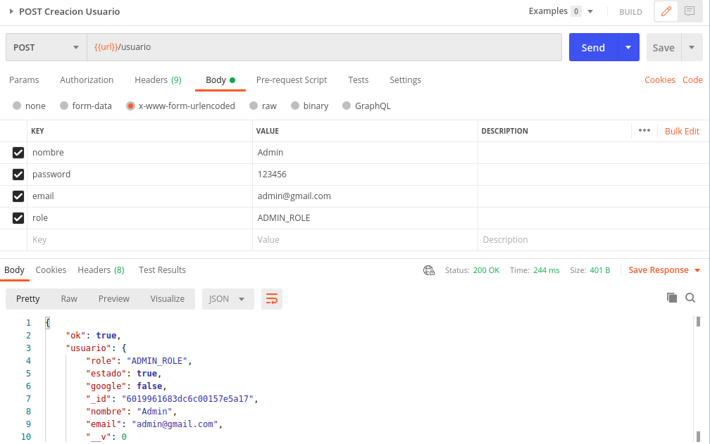
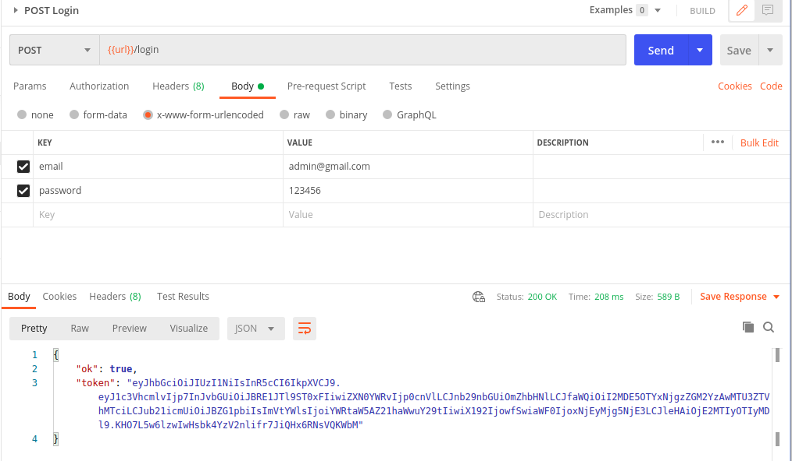
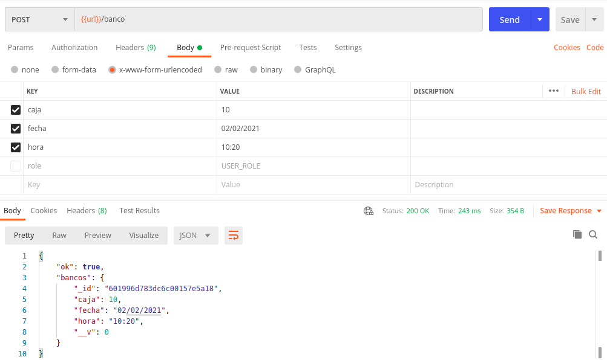
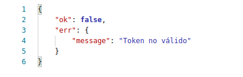
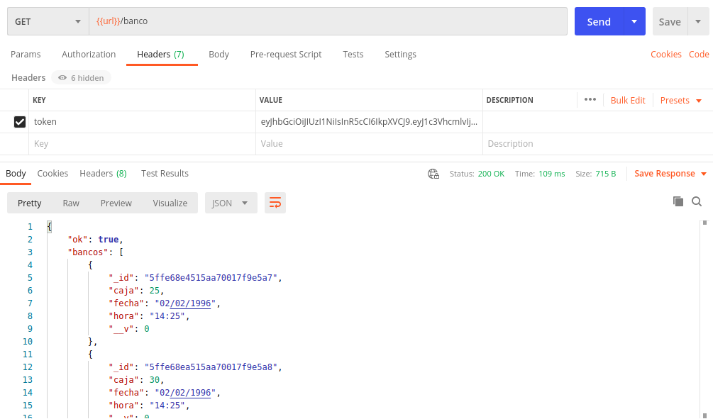
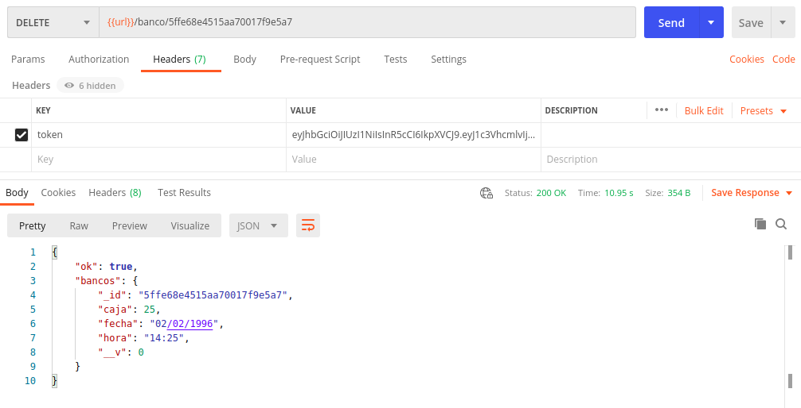
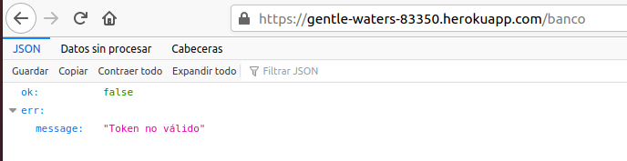
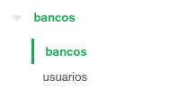
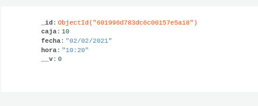
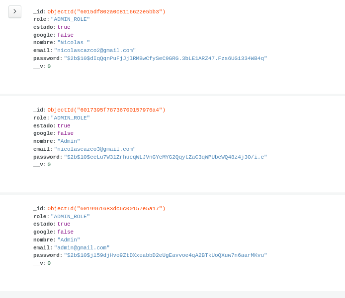

# APP Rest Turno de caja de Banco :computer:
La siguiente API REST consiste en la generacion de un turno automatico al momento de presionar un
boton el cual almacena un turno en una base de datos previamente creada en MondoDB Atlas en conjunto con 
fecha y hora actual del sistema, para luego presentar el reporte creado en un dato tipo JSON, dicho
sistema cuenta con la posibilidad de filtrar la informacion almcenada mediante filtros de hora y fecha
y la eliminacion de Id de usuarios si es necesario, cabe mencionar que para el uso de los metodos mencionados
lo podra realizar solo los Admin registrados en el sistema con un token generado automaticamente cuando se ingrese al
sistema, como ya se menciono todos los usuarios y administradores se encuentran de igual forma almacenados en MongoDB Atlas

 
# Aplicacion Web :beginner:

La aplicacion se encuentra alojada en un repositorio de Heroku [Aplicacion](https://gentle-waters-83350.herokuapp.com/) donde se puede comprobar su funcionalidad con la aplicacion de su agrado en este caso se opto por usar "Postman"

# Dependencias :memo:

   * body-parser - Middleware de análisis del cuerpo
   * express - Framework web
   * mongoose - Base de Datos
   * bcrypt -
   * jsonwebtoken -
   * underscore -
   
# Herramientas :hammer:

   * Visual Studio Code 
   * Postman 
   * MongoDB Atlas 
   
# Funcionamiento Aplicacion :lock:

Para la ejecucion de la aplicacion se necesitara en primera instancia tener una cuenta admin previamente creada con usuario "ADMIN_ROLE" 

Una vez creado el nuevo usuario este debera ingresar(Login) para generar un token que le permitira utilizar manipular todos los metodos previamente creados

# Metodos :open_file_folder:
## Post

En este metodo lo que se hace es ingresar los datos que se generan al momento de presionar un boton y este almacena en la base de datos los campos
 * Hora :watch:
 * Fecha :date:
 * Caja :fax:
 
En este caso este metodo se encuntra validado con un token para poder ingresar datos, si todo es correcto el mensaje que deberia desplegar es el siguiente
 

En caso de que no se este ingresado el token correcto el mensaje sera el siguiente:

## Get

En el siguiente metodo lo que se hace es consultar a la base de datos toda la informacion almacenada, en este caso por filtros donde se obtiene el numero de cajas que se han ingresado en un fecha especifica, cabe mencionar que de igual forma se requiere el token generado por el usuario logueado para obtener los datos y nos lo mostrara de la siguiente manera:

## Delete

El siguiente metodo permite al administrador eliminar un registro previo realizado en caja, como ya se menciono de igual forma se necesita ser administrador y un token generado 

# Despliegue :partly_sunny:

EL deploy de la aplicacion se encuentra en Heroku [Aplicacion](https://gentle-waters-83350.herokuapp.com/)

# Base de datos

Como ya se menciono al app cuenta con un sustema de base de datos donde se almacenan los datos ingresados tanto de usuarios como de turnos de caja para la prueba y ejecucion del mismo se lo realizo local y en la web como se detalla a continuacion podemos ver el almacenamiento exitoso de la informacion en ambos casos

## Tablas

## Atlas: MongoDB

## Local

# Autor :man:

Nicolas Cazco
